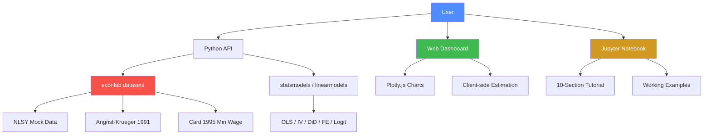

# EconomicsLab -- Interactive Economics Computing Laboratory

<p align="center">
  
  
  
  
  
  <br>
  
  
  
</p>

<p align="center">
  <b>An open-source, interactive economics computing laboratory with built-in datasets, econometric models, Jupyter notebooks, and a web dashboard.</b>
</p>

---

## Table of Contents

- [Features](#features)
- [Quick Start](#quick-start)
- [Installation](#installation)
- [Usage Examples](#usage-examples)
  - [Load Built-in Datasets](#load-built-in-datasets)
  - [Ordinary Least Squares](#ordinary-least-squares)
  - [Instrumental Variables](#instrumental-variables)
  - [Difference-in-Differences](#difference-in-differences)
  - [Panel Fixed Effects](#panel-fixed-effects)
  - [Binary Choice Models](#binary-choice-models)
- [Web Dashboard](#web-dashboard)
- [API Reference](#api-reference)
- [Architecture](#architecture)
- [Comparison with Other Tools](#comparison-with-other-tools)
- [Contributing](#contributing)
- [Citation](#citation)
- [License](#license)

---

## Features

| Feature | Description |
|---|---|
| Datasets | Built-in mock datasets: NLSY, Angrist-Krueger 1991, Card 1995 |
| OLS | Ordinary least squares with robust, clustered, and classical SE |
| IV/2SLS | Two-stage least squares with first-stage diagnostics |
| DiD | Difference-in-differences with interaction terms |
| Panel FE | Within-transformation fixed effects estimator |
| Logit/Probit | Binary choice models with marginal effects |
| Web Dashboard | Interactive browser-based modeling with Plotly.js |
| Jupyter | Comprehensive 10-section tutorial notebook |
| Simulation | Monte Carlo simulation for estimator properties |

---

## Quick Start

```bash
pip install econlab[full]
```

```python
import econlab
from econlab.datasets import load_angrist_krueger

# Load Angrist-Krueger 1991 returns-to-education data
df = load_angrist_krueger()

# Run IV regression with statsmodels
import statsmodels.api as sm
import pandas as pd

qob_dummies = pd.get_dummies(df["qob"], prefix="qob", drop_first=True)
from linearmodels.iv import IV2SLS

model = IV2SLS(
    dependent=df["log_wage"],
    exog=None,
    endog=df["education"],
    instruments=qob_dummies,
)
results = model.fit()
print(results.summary)
```

---

## Installation

### From PyPI (recommended)

```bash
pip install econlab
```

For Jupyter support and all extras:

```bash
pip install econlab[full]
```

### From Source

```bash
git clone https://github.com/econlab/econlab.git
cd econlab
pip install -e ".[dev]"
```

### Requirements

- Python >= 3.9
- numpy, pandas, scipy
- statsmodels, linearmodels
- matplotlib, seaborn, plotly

See [requirements.txt](requirements.txt) for the full list.

---

## Usage Examples

### Load Built-in Datasets

```python
from econlab.datasets import load_nlsy, load_angrist_krueger, load_card_minwage
from econlab import list_datasets, get_dataset_info

# List all available datasets
print(list_datasets())
# ['angrist_krueger', 'card_minwage', 'nlsy']

# Get metadata
info = get_dataset_info("nlsy")
print(f"Observations: {info['n_obs']}, Variables: {info['n_vars']}")

# Load and explore
nlsy = load_nlsy()
print(nlsy.describe())
```

### Ordinary Least Squares

```python
from econlab.datasets import load_nlsy
import statsmodels.formula.api as smf

df = load_nlsy()

# Mincer earnings regression
model = smf.ols(
    "log_wage ~ education + experience + I(experience**2) + female",
    data=df
)
results = model.fit(cov_type="cluster", cov_kwds={"groups": df["id"]})
print(results.summary())
```

### Instrumental Variables

```python
from econlab.datasets import load_angrist_krueger
from linearmodels.iv import IV2SLS
import pandas as pd

df = load_angrist_krueger()
qob = pd.get_dummies(df["qob"], prefix="qob", drop_first=True)

model = IV2SLS(
    dependent=df["log_wage"],
    exog=None,
    endog=df["education"],
    instruments=qob,
)
res = model.fit()
print(res.summary)
```

### Difference-in-Differences

```python
from econlab.datasets import load_card_minwage
import statsmodels.formula.api as smf

df = load_card_minwage()

model = smf.ols("fte ~ treated * post", data=df)
results = model.fit(cov_type="HC1")

# The DiD estimate is treated:post coefficient
print(f"DiD estimate: {results.params['treated:post']:.3f}")
```

### Panel Fixed Effects

```python
from econlab.datasets import load_nlsy
from linearmodels.panel import PanelOLS

df = load_nlsy()
df = df.set_index(["id", "year"])

model = PanelOLS(
    dependent=df["log_wage"],
    exog=df[["experience", "hours", "union"]],
    entity_effects=True,
    time_effects=False,
)
results = model.fit()
print(results.summary)
```

### Binary Choice Models

```python
from econlab.datasets import load_nlsy
import statsmodels.api as sm

df = load_nlsy()

X = sm.add_constant(df[["education", "experience", "female"]])
y = df["union"]

logit = sm.Logit(y, X).fit(disp=False)
print(logit.summary())

# Marginal effects
print(logit.get_margeff().summary())
```

---

## Web Dashboard

EconomicsLab ships with a fully client-side interactive web dashboard.

<p align="center">
  <em>Run econometric models without writing code.</em>
</p>

**Launch:**

```bash
cd econlab/webapp
python -m http.server 8080
# Visit http://localhost:8080 in your browser
```

**Features:**
- Dark theme professional UI
- 5 model types with dynamic parameter forms
- Live Plotly.js coefficient charts with 95% confidence intervals
- Full regression tables with t-statistics and p-values
- Monte Carlo simulation for exploring estimator properties
- Zero server dependencies -- runs entirely in the browser

---

## API Reference

| Function | Description |
|---|---|
| `econlab.load_nlsy()` | Load NLSY mock panel dataset (5,000 individuals x 10 years) |
| `econlab.load_angrist_krueger()` | Load Angrist-Krueger 1991 QOB data (2,000 obs) |
| `econlab.load_card_minwage()` | Load Card-Krueger 1994 min wage data (400 obs) |
| `econlab.list_datasets()` | List all available dataset names |
| `econlab.get_dataset_info(name)` | Get metadata dict for a dataset |

Full API documentation: [docs/api.md](docs/api.md)

User guide with detailed examples: [docs/user-guide.md](docs/user-guide.md)

Jupyter tutorial: [econlab/notebooks/tutorial.ipynb](econlab/notebooks/tutorial.ipynb)

---

## Architecture



---

## Comparison with Other Tools

| Feature | EconomicsLab | statsmodels | linearmodels | Stata | R (fixest) |
|---|---|---|---|---|---|
| Built-in datasets | Yes | No | No | Yes | Limited |
| Web dashboard | Yes | No | No | No | No |
| Jupyter tutorial | 10 sections | Partial | Partial | -- | -- |
| OLS with robust SE | Yes | Yes | Limited | Yes | Yes |
| IV/2SLS | Yes | Yes | Yes | Yes | Yes |
| DiD | Yes | Formula API | -- | Yes | Yes |
| Panel FE | Yes | Yes | Yes | Yes | Yes |
| Logit/Probit | Yes | Yes | -- | Yes | Yes |
| Client-side execution | Yes | No | No | No | No |
| Open source (MIT) | Yes | BSD | BSD | Proprietary | GPL-3 |

---

## Contributing

We welcome contributions! Whether you want to add a new dataset, implement an econometric method, fix a bug, or improve documentation -- all PRs are appreciated.

See [CONTRIBUTING.md](CONTRIBUTING.md) for detailed guidelines on:

- Development environment setup
- Coding standards
- Testing
- Pull request process
- Adding new datasets and models

---

## Citation

If you use EconomicsLab in your research or teaching, please cite:

```bibtex
@software{econlab2026,
  author       = {EconomicsLab Contributors},
  title        = {EconomicsLab: Interactive Economics Computing Laboratory},
  year         = {2026},
  version      = {0.1.0},
  url          = {https://github.com/econlab/econlab},
  license      = {MIT}
}
```

---

## References

The built-in datasets are patterned after these seminal papers:

- Angrist, J. D. & Krueger, A. B. (1991). "Does Compulsory School Attendance Affect Schooling and Earnings?" *Quarterly Journal of Economics*, 106(4), 979-1014.
- Card, D. & Krueger, A. B. (1994). "Minimum Wages and Employment: A Case Study of the Fast-Food Industry in New Jersey and Pennsylvania." *American Economic Review*, 84(4), 772-793.
- Card, D. (1995). "Using Geographic Variation in College Proximity to Estimate the Return to Schooling." In *Aspects of Labour Market Behaviour: Essays in Honour of John Vanderkamp*. University of Toronto Press.

---

## License

EconomicsLab is released under the [MIT License](LICENSE).

---

<p align="center">
  <sub>Built with care for the economics community. Star this repo if you find it useful!</sub>
</p>
